<!-- ========================================================================= -->
<!--                          VARSHUAI — PROFILE README                        -->
<!--       Cyberpunk Premium Theme  |  Animated SVGs  |  Live Badges           -->
<!-- ========================================================================= -->

<div align="center">

<!-- ============================== BANNER ============================== -->



<!-- ============================== TYPING SVG ============================== -->

<br/>

[](https://github.com/VarshuAi)

<!-- ============================== WAVE DIVIDER ============================== -->


</div>

<!-- ============================== ABOUT ME ============================== -->

<h2>
 
<samp>&nbsp;ABOUT ME</samp>
</h2>

```yaml
name: VarshuAi
title: System Architect & Security Researcher
location: Planet Earth
status: Always Shipping Code

specializations:
  - Full-Stack Development (React, Next.js, Node, Python, Go)
  - Security Research & Ethical Hacking
  - Cloud Architecture (AWS, GCP, Azure)
  - DevSecOps & Infrastructure Automation
  - AI/ML Engineering

motto: "Build Fast. Ship Secure. Scale Infinite."
```

<!-- ============================== SNAKE ANIMATION ============================== -->

<div align="center">
<br>

<br>
</div>

<!-- ============================== TECH ARSENAL ============================== -->

<h2>

<samp>&nbsp;TECH ARSENAL</samp>
</h2>

<div align="center">

#### `>> LANGUAGES`


#### `>> FRAMEWORKS & LIBRARIES`


#### `>> SECURITY & DEVOPS`


#### `>> CLOUD & DATABASE`


#### `>> AI & ML`


</div>

<!-- ============================== ANIMATED DIVIDER ============================== -->


<!-- ============================== GITHUB STATS ============================== -->

<h2>

<samp>&nbsp;PERFORMANCE METRICS</samp>
</h2>

<div align="center">

<a href="https://github.com/VarshuAi">
  
  
</a>

<br/><br/>

<!-- Streak Stats -->


<br/><br/>

<!-- Activity Graph -->


</div>

<!-- ============================== ANIMATED DIVIDER ============================== -->


<!-- ============================== ACHIEVEMENTS ============================== -->

<h2>

<samp>&nbsp;ACHIEVEMENTS</samp>
</h2>

<div align="center">


</div>

<!-- ============================== ANIMATED DIVIDER ============================== -->


<!-- ============================== SKILL BARS (ANIMATED SVG) ============================== -->

<h2>

<samp>&nbsp;SKILL PROFICIENCY</samp>
</h2>

<div align="center">

```
 Python         ████████████████████████████████████████░░░░  93%
 JavaScript     ██████████████████████████████████████░░░░░░  90%
 TypeScript     ████████████████████████████████████░░░░░░░░  87%
 Go             █████████████████████████████████░░░░░░░░░░░  82%
 Rust           ████████████████████████████░░░░░░░░░░░░░░░░  75%
 Security       █████████████████████████████████████████░░░  95%
 Cloud/DevOps   ████████████████████████████████████████░░░░  92%
 AI/ML          ████████████████████████████████░░░░░░░░░░░░  80%
 System Design  ████████████████████████████████████████░░░░  93%
```

</div>

<!-- ============================== ANIMATED DIVIDER ============================== -->


<!-- ============================== FEATURED PROJECTS ============================== -->

<h2>

<samp>&nbsp;FEATURED PROJECTS</samp>
</h2>

<div align="center">
<table>
<tr>
<td width="50%" valign="top">

<h3 align="center">Go SSH Auditor</h3>
<div align="center">

[](https://github.com/VarshuAi/go-ssh-auditor)

`Go` `Security` `SSH` `Concurrent`

</div>
</td>

<td width="50%" valign="top">

<h3 align="center">Packet Sniffer</h3>
<div align="center">

[](https://github.com/VarshuAi/py-packet-sniffer)

`Python` `Networking` `Raw Sockets` `Sniffer`

</div>
</td>
</tr>

<tr>
<td width="50%" valign="top">

<h3 align="center">Rust Port Scanner</h3>
<div align="center">

[](https://github.com/VarshuAi/rust-port-scanner)

`Rust` `Networking` `Tokio` `Async`

</div>
</td>

<td width="50%" valign="top">

<h3 align="center">System Monitor Dashboard</h3>
<div align="center">

[](https://github.com/VarshuAi/bash-sys-monitor)

`Bash` `Systems` `Monitor` `Webhook`

</div>
</td>
</tr>
</table>
</div>

<!-- ============================== ANIMATED DIVIDER ============================== -->


<!-- ============================== METRICS ============================== -->

<h2>

<samp>&nbsp;SYSTEM DIAGNOSTICS</samp>
</h2>

<div align="center">

<!-- Profile Views -->


<br/><br/>

<!-- Wakatime-style stats block -->
```diff
@@                    VarshuAi System Status Report                    @@

+  Repositories Created    ███████████████████████████████  650+
+  Languages Mastered      █████████████████████████████░░  11
+  Security Tools Built    ████████████████████████████░░░  150+
+  Frameworks Used         █████████████████████████████░░  12+
+  Cloud Platforms         ██████████████████████████████░  3
+  Open Source Projects    ███████████████████████████████  500+

!  Status: ACTIVELY BUILDING
#  Last Updated: 2025
```

</div>

<!-- ============================== ANIMATED DIVIDER ============================== -->


<!-- ============================== CERTIFICATIONS ============================== -->

<h2>

<samp>&nbsp;DOMAINS OF EXPERTISE</samp>
</h2>

<div align="center">

| Domain | Specialization | Level |
|--------|---------------|-------|
| Security | Penetration Testing, Vulnerability Research, SIEM | Expert |
| Backend | Microservices, API Design, Distributed Systems | Expert |
| Frontend | React Ecosystems, Animation, WebGL | Advanced |
| DevOps | CI/CD, IaC, Container Orchestration | Expert |
| AI/ML | NLP, Computer Vision, LLM Fine-tuning | Advanced |
| Cloud | Multi-cloud Architecture, Serverless | Expert |
| Mobile | Flutter, React Native, Native Android | Advanced |
| Blockchain | Smart Contracts, DeFi, Auditing | Intermediate |

</div>

<!-- ============================== ANIMATED DIVIDER ============================== -->


<!-- ============================== QUOTES ============================== -->

<div align="center">


</div>

<!-- ============================== CONNECT ============================== -->

<br/>

<h2>

<samp>&nbsp;CONNECT</samp>
</h2>

<div align="center">

[](https://github.com/VarshuAi)
[](https://linkedin.com/in/VarshuAi)
[](https://twitter.com/VarshuAi)
[](https://discord.gg/VarshuAi)
[](https://varshuai.dev)

</div>

<!-- ============================== FOOTER WAVE ============================== -->

<br/>


<div align="center">


<br/><br/>

<samp>
<sub>// Every line of code is a step toward the future.</sub>
</samp>

</div>
