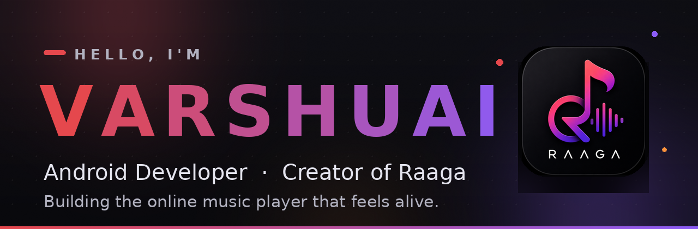
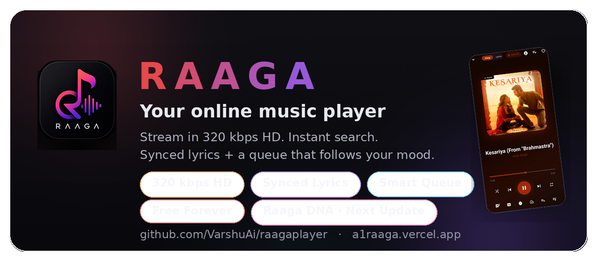

<!-- ══════════════════════════════════════════════════════════════
     GitHub PROFILE README — user: VarshuAi
     Deploy: create a public repo named exactly  VarshuAi  and upload
     this README.md + the assets/ folder + .github/workflows/snake.yml
     ══════════════════════════════════════════════════════════════ -->

<div align="center">



<a href="https://github.com/VarshuAi">
  
</a>

<p>
  
  &nbsp;
  <a href="https://github.com/VarshuAi?tab=followers"></a>
  &nbsp;
  <a href="https://github.com/VarshuAi/raagaplayer"></a>
</p>

</div>

### 🎧 About me

```kotlin
val varshuAi = developer {
    role        = "Android Developer"
    building    = "Raaga — the online music player that feels alive"
    stack       = listOf("Kotlin", "Jetpack Compose", "Material Design 3")
    currently   = "Shipping Raaga DNA — your listening, decoded (next update)"
    philosophy  = "Fast. Fluid. Feels alive."
    funFact     = "I test every build at 320 kbps — quality first 🎶"
}
```


## 🚀 Featured Project

<div align="center">

<a href="https://github.com/VarshuAi/raagaplayer">
  
</a>

[](https://github.com/VarshuAi/raagaplayer/releases/download/music/a1raaga.apk)
[](https://a1raaga.vercel.app)
[](https://github.com/VarshuAi/raagaplayer)

<p>
  
  
  
  
  
</p>

</div>


## 🛠️ Tech Arsenal

<div align="center">
  <a href="https://skillicons.dev">
    
  </a>
</div>


## 📊 GitHub Stats

<div align="center">
  
  
</div>

<div align="center">
  
</div>

## 🏆 Trophies

<div align="center">
  
</div>

## 📈 Activity Graph

<div align="center">
  
</div>

## 🐍 Contribution Snake

<div align="center">
  <picture>
    <source media="(prefers-color-scheme: dark)" srcset="https://raw.githubusercontent.com/VarshuAi/VarshuAi/output/github-snake-dark.svg"/>
    <source media="(prefers-color-scheme: light)" srcset="https://raw.githubusercontent.com/VarshuAi/VarshuAi/output/github-snake.svg"/>
    
  </picture>
</div>


## 🤝 Connect

<div align="center">

[](https://github.com/VarshuAi)
[](https://a1raaga.vercel.app)
[](mailto:YOUR-EMAIL-HERE)

</div>

<div align="center">

> _"Where words fail, music speaks."_ 🎵


</div>

<!-- 💡 CUSTOMIZE:
     1. Replace YOUR-EMAIL-HERE in the Connect row.
     2. Add/remove skills in the Tech Arsenal skillicons?i= list.
     3. Add your X/LinkedIn/Instagram badges in Connect if you have them.
     4. Snake: enable GitHub Actions and run the workflow once (see INSTALL.md).
-->
